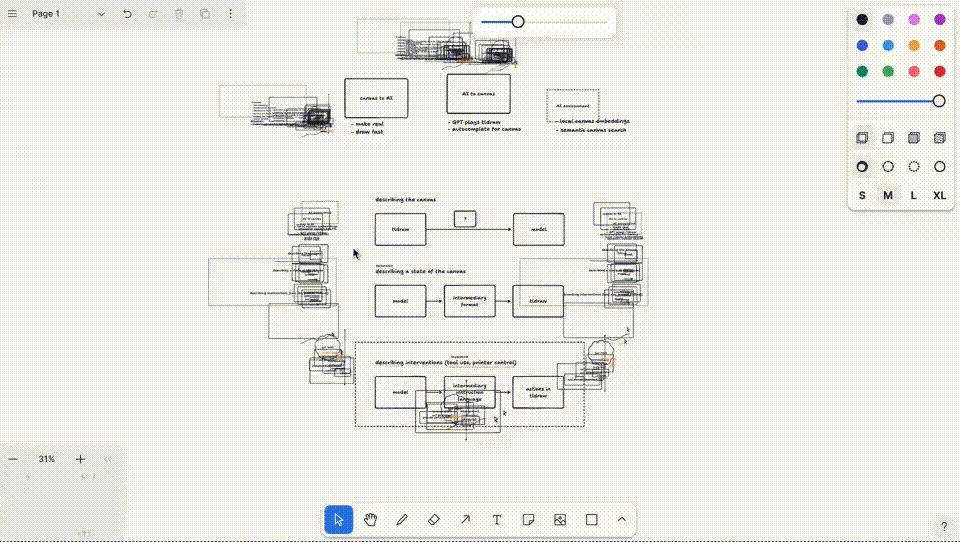

# 5D Note taking application

## Spec

The requirements are as follows

- Nodes
  - Create a 3D node
  - Delete the node
  - Label the node
    - Change the label
    - Remove the label
    - Move the label within reasonable proximity of the node
- What is a node?
  - A node is a container connected to other nodes
  - The container (or "dimension") allows you to "step into" it and
    - It is a regular document such as a txt, spreadsheet etc.
    - Or, it "contains" other nodes that have been created specifically within it
    - You may step into a doc or container node but they must be distinguishable
    - A node may exist in multiple containers simultaneously (singleton)
      - A node at depth 3 of some node may itself be a top level node in another plane
- Connections
  - Nodes can be connected
  - Selecting the node highlights nodes immediately connected to it via configurable "n" hops
  - Moving between nodes should make it clear which plane/level is left and which is entered
    - This enables a constant map of where you are across all planes in absolute space
- Space
  - Nodes are placed in space on static coordinates
  - Nodes can be moved to different coordinates
  - The focal point (camera) moves through the space while the nodes remain in place
- Updating nodes
  - Each node is version controlled independently of other nodes around it
    - Changing a higher order node necessarily tracks and branches with the internal nodes
  - It must be clear which version the nodes are in the view of the camera
  - When selecting a different version of a node there should be a preview of how the network of nodes will be affected
  - Since nodes are singletons, updating a node updates it across all planes

## Media

Let's take a look at some visual examples to get an idea of the spec.

### 3D canvas for text

- Canvas enables a user to create and link 2D text boxes in a 3D space
- Text boxes appear to be grouped and traversing occurs by moving from one group of boxes to another (rather than traversing the space itself while the boxes remain under static coordinates)

Source: [Twitter @Hamptonism](https://x.com/Hamptonism/status/1805247267797889422)

### 3D Social Graph: Twitter

- A 3D social graph with static nodes that enable traversal though space.
- Nodes are nicely connected

<video width="600" controls>
  <source src="../.media/5d-notes/3d-twitter-graph.mp4" type="video/mp4">
  Your browser does not support the video tag.
</video>

Source: [Twitter @ilaffey2](https://x.com/ilaffey2/status/1645962525349928965)

### 3D Social Graph: Discord

- Another social graph with focused nodes and nicer traversal

<video width="600" controls>
  <source src="../.media/5d-notes/3d-discord-graph.mp4" type="video/mp4">
  Your browser does not support the video tag.
</video>

Source: [Twitter @fr3fou](https://x.com/fr3fou/status/1774565881336459588)

